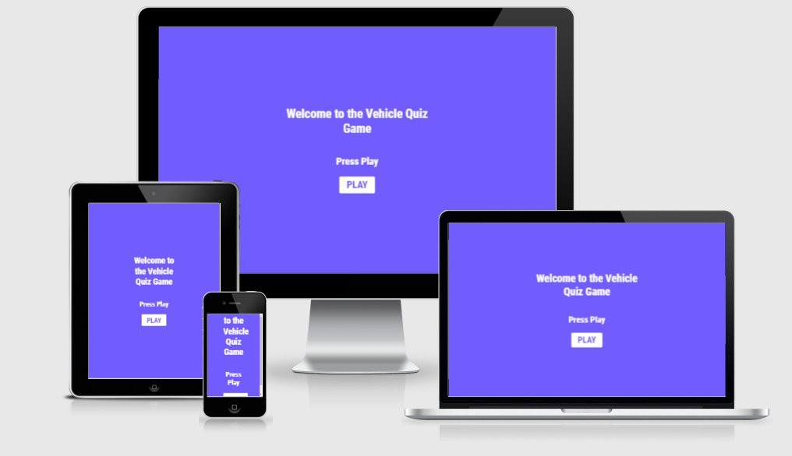

# Vehicle Quiz Game
The vehicle quiz game is a game for vehicle enthusiasts. It includes 30 questions in total comprising of mostly multiple-choice questions and some true or false questions. The multiple-choice questions each come with four options to choose from. They range from questions about cars to trains and motorcycles with varying difficulty levels.     

The Responsive Mockup image above shows how responsive the Vehicle quiz game is across various device screen sizes ranging from mobile devices to large monitor screens. The Vehicle quiz game is well layed out with a clear font style used across the pages. The buttons are very legible on all the screen sizes. 

## UX

### Colour Scheme Used
I chose to go with a very rich and bright color scheme through out the site to express to the user a sense of fun and playfulness. The dark and light shades of purple compliment each other very well.The buttons are large enough to be clicked on and touched with the fingers on a touch screen. Hover effects are used on all the buttons to further enhance the legibility of the buttons and thus the user experience. On selecting the correct answer, the button turns to a very bright green color while on selecting the wrong answer it changes to a bright red color. The background color also changes color depending on whether the user selects the correct or wrong answer to further get the user engaged in the game. 

### Typography

I chose to use the font called Roboto Condensed from Google fonts throughout the website because it is a bold and striking font that not only evokes seriousness and passion, but when used along side the bright colors on the site also creates a sense of playfulness.

### Wireframes

Below are sketched images of how I planned to layout the quiz game. The lines across indicate that background colors were used. The final design for the restart button is slightly different from the wireframe image because I decided to include the user score so added the restart button to the screen that shows the user score. I also added the home button below the restart button.

## Features 

### Existing Features

- __Play Button__

  - It is a large and bold button  with the word play written on it that screams click me !!!.
  - It has a hover effect applied on it to show user that something is about to happen when they run the mouse pointer over it. It also has a box shadow effect around it to further make it stand out.  

- __The home page__

  - The home page features a very bright purple background color with some text to tell the user what to do which is to press the play button.
 

- __The "Let's Go" button__

  - The "Let's Go" button is what the user clicks to start the game. 
  - It is a large and bold button that also screams click me !!!.
  - The button features a hover effect in the form of a bacground color change from a dark shade of purple to a lighter shade of purple to show the user that an action is about to occur.

- __The Question and Answer Box__

  - This box contains the questions written boldy in black over the white background. 
  -  It also houses the answers contained in bold buttons which changes color to green when the answer selected is correct and to red when the wrong answer is selected.

  __The Next Button__

  - The next button does not appear till after the first question has been answered.
  - The next button when selected reveals the next question. 
  - The next button is hiddened when the next question is displayed.

  __The User Score Screen__

  - This screen is made up of the user's score area, the restart button and the home button.
  - This screen appears after the user has answered a set of 10 questions. The user's score is calculated and displayed boldly in simple text.
  - The user can then choose to restart the game by clicking on the restart button or to go back to the home page by clicking on the home button. 

  __The Restart Button__

  - The restart button, when clicked, takes the user back to the start screen with the "Let's Go" button. The user can then click on the Let's Go button which will show another set of 10 random questions for the user to answer.

- __The Home Button__

  - The home button, when clicked, takes the user back to the home page with the play button.

### Features Left to Implement

- A more interactive home page that lays out how to play the game and the features of the game.
- The ability to save your game with a user profile.
- A high score table showing top user scores. 

## Technologies Used

- I used HTML to design the two web pages.
- I used CSS to design the enitre website.
- I used Javascript to add fuctionality to the game enabling user interaction.
- I used Gitpod as my code editor to write all the codes used throughout the website.
- I used Github to host my repositories.
- I used Git for version control of the website.
- I used Open Trivia Database to generate all the questions used in the quiz game.
- I used the Google Chrome development tool for troubleshooting.

## Testing 

- I confirmed that all buttons were functional.
- I tested that the home button links back to the home page.
- I tested the site for responsiveness making sure that it looks easy to use across all standard screen sizes using the Google chrome development tool.
- I checked that random sets of questions were being generated each time the restart button was clicked.
I tested that the correct user scores were displayed at the end of the game.  

### Validator Testing 

- HTML
  - No errors were returned when passing through the official [W3C validator](https://validator.w3.org/nu/?doc=https://onabz.github.io/Vehicle-Quiz-Game/) (index.html)
 
  - No errors were returned when passing through the official [W3C validator](https://validator.w3.org/nu/?doc=https://onabz.github.io/Vehicle-Quiz-Game/game.html) (game.html)
 
- CSS
  - No errors were found when passing through the official [(Jigsaw) validator](https://jigsaw.w3.org/css-validator/validator?uri=https%3A%2F%2Fonabz.github.io%2FVehicle-Quiz-Game%2F&profile=css3svg&usermedium=all&warning=1&vextwarning=&lang=en)

- Javascript
  - No errors were found when passing through the [JSHint](https://jshint.com/)

## Deployment

The site was deployed to GitHub pages. The steps to deploy are as follows:
    * In the [GitHub repository](https://github.com/onabz/Vehicle-Quiz-Game), navigate to the Settings tab.
    * From the Settings tab, scroll down until you see the 'Pages' button on the left.
    * From the Source section drop-down menu, select the `Main` branch.
    * Once the `Main` branch has been selected, the page will be automatically refreshed with a detailed ribbon display to indicate the successful deployment.

The live link can be found here - https://onabz.github.io/Vehicle-Quiz-Game/

### Local Deployment

To make a local copy of this project, you can clone it by typing the following in your IDE terminal:

- `git clone https://github.com/onabz/Vehicle-Quiz-Game.git`

Alternatively, if using Gitpod, you can click the green Gitpod button, or use [this link](https://gitpod.io/#https://github.com/onabz/Vehicle-Quiz-Game)

## Credits 
 
### Content 

- Many of the Javascript functions used in making the quiz functional were from [Build A Quiz App With JavaScript](https://www.youtube.com/watch?v=riDzcEQbX6k)
- Steps on how to style the user score text were from [Create a Quiz App using HTML CSS & JavaScript | Quiz Web App using JavaScript](https://www.youtube.com/watch?v=CqddbIrEM5I&t=933s)
- The line of code I used to create the restart button was from [Reload Page - HTML - Javascript lesson 4](https://www.youtube.com/watch?v=SQFwFjMUgUc)
- Explanations on how to go about calculating the user scores and displaying them were from my Menthor Tim Nelson. 
- The font used throughout the site called Roboto Condensed was from Google fonts [Google Fonts](https://fonts.google.com/specimen/Roboto+Condensed?preview.text=muscle%20gains%20power%20lifitng&preview.text_type=custom&query=roboto+#standard-styles)
- All the questions used in the quiz game were generated from  [Open Trivia Database](https://opentdb.com/api_config.php)

### Acknowledgements

- I would like to thank my Mentor Tim Nelson for his invaluable support all through this project. I would not have been able to put all this together if not for his patience and insight.
- I would like to thank [Student Care](https://learn.codeinstitute.net/ci_support/diplomainsoftwaredevelopmentecommerce/studentcare) for their regular check up on me to ensure that I was always on track to completing this project and to reassure me that they were always available if I needed any help.